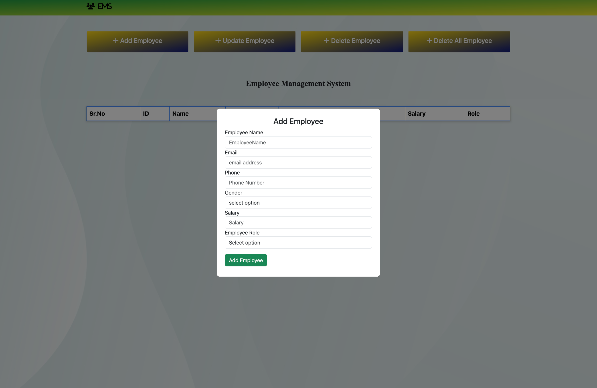

# Employee Management Application

A fast and reliable Employee Management application with a sleek and simple UI combined with modern tech stack. A full-stack web application built using Spring Boot, Thymeleaf, and MongoDB Atlas to manage employee data efficiently. It provide a simple CRUD operation interface- allows you to add, view, update, and delete employee records — all through a responsive web UI.

## Deployment

To deploy this project run

```bash
mvn spring-boot:run
```

## Tech Stack

- **Backend:** Spring Boot
- **Frontend:** Thymeleaf (HTML, CSS, JS, Bootstrap)
- **Database:** MongoDB Atlas (Cloud)
- **Build Tool:** Maven
- **Server:** Embedded Tomcat

## ⚙️ MongoDB Atlas Setup

To connect the project with **MongoDB Atlas**, follow these steps:

### 1️⃣ Create an Account

Go to [MongoDB Atlas](https://www.mongodb.com/cloud/atlas) and sign up.

### 2️⃣ Create a Cluster

Click **"Build a Database"** and choose the free shared cluster.

### 3️⃣ Add Network Access

- Go to **Network Access → Add IP Address**
- Add your current IP or select **Allow Access from Anywhere (0.0.0.0/0)**

### 4️⃣ Create a Database User

- Go to **Database Access → Add New Database User**
- Set a username and password
- Give the user the role: `readWriteAnyDatabase`

### 5️⃣ Get Connection String

Go to **Clusters → Connect → Drivers**  
Copy your connection string and replace `<db_username>` and `<db_password>`:

spring.data.mongodb.uri=mongodb+srv://<db_username>:<db_password>@myatlasclusteredu.pohvd7h.mongodb.net/?retryWrites=true&w=majority&appName=myAtlasClusterEDU

Save and run the project

🧩 Features

➕ Add new employees with name, email, phone, salary, and role

📋 View all employees in a clean, tabular layout

✏️ Update existing employee details

❌ Delete specific or all employees

☁️ Real-time data sync with MongoDB Atlas

💻 Responsive and modern UI with Bootstrap

###🧠 Run Locally

Clone the project:

```bash
git clone https://github.com/<your-username>/employee-management-system.git
```

Navigate to the project directory:

```bash
cd employee-management-system
```

Run the application:

```bash
mvn spring-boot:run
```

###📸 Screenshots




###👨‍💻 Author

Ashish Yadav
Aspiring Software Developer | Java & Spring Boot Enthusiast
